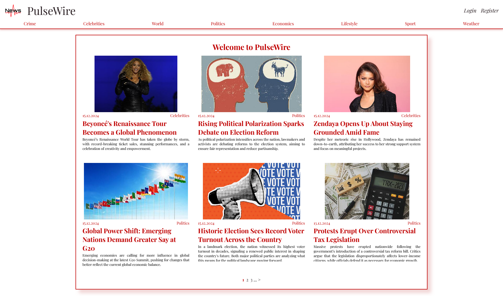
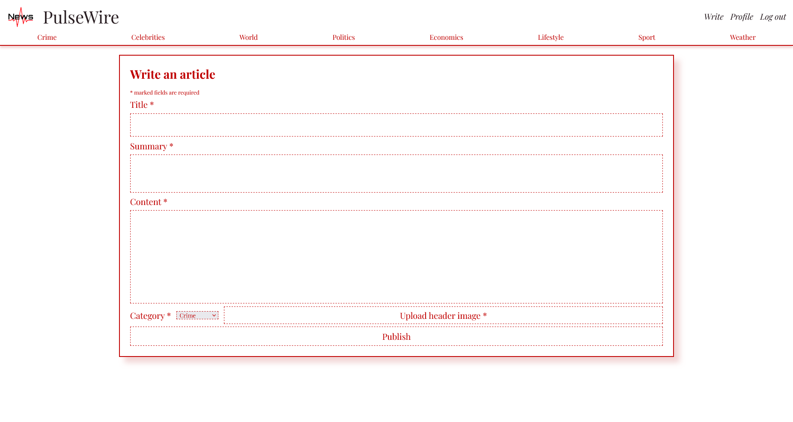
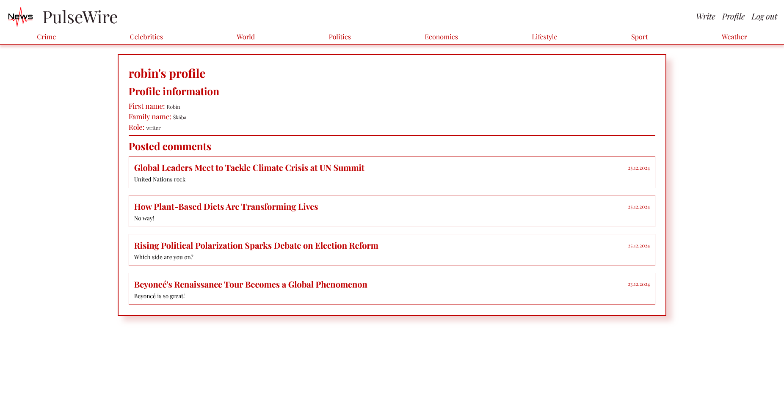
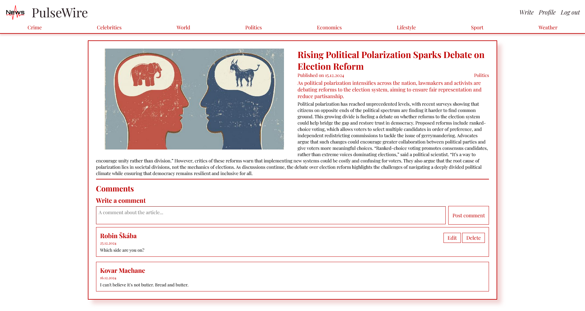

# PulseWire
*a news website*

A university project for a course on website applications. Built without any frameworks.

#### Screenshots

    
    
    
    

#### Technologies
- PHP, JavaScript, HTML, and CSS
- JSON database

#### Pages
- paginated articles overview
- form for writing a new article
- admin page for managing users
- login and registration
- article page
- articles filtered by category